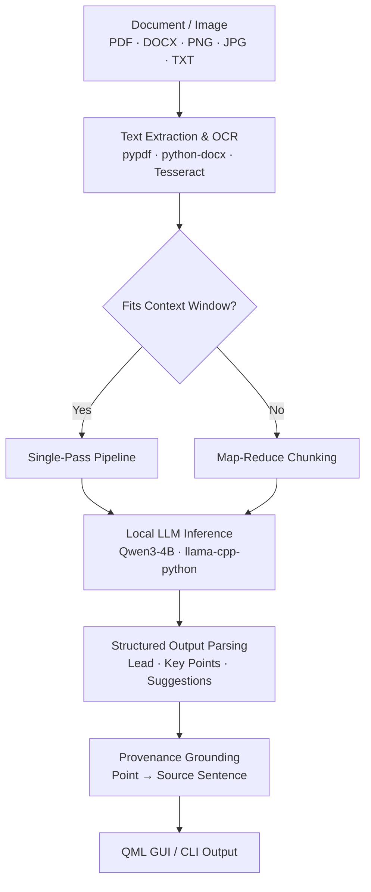

<div align="center">

# DocSummarizer — Document Summary Assistant

**Offline document summarization & intelligence, powered by a local language model.**

Extract, OCR, chunk, and generate smart summaries of academic papers, business documents, and images entirely on your machine — zero cloud, zero telemetry, 100% private.

[](https://github.com/Balaji268268/Document-Analyzer/actions/workflows/ci.yml)
[](https://www.python.org/)
[](#system-requirements)
[](LICENSE)
[](https://docs.astral.sh/ruff/)
[](https://mypy-lang.org/)
[](#privacy--security)

</div>

---

## 1. Overview

DocSummarizer is a privacy-first desktop application that generates smart summaries, key points, and document quality suggestions from uploaded files (PDF, DOCX, RTF, TXT, MD, PNG, JPG). Powered by a local quantized LLM ([Qwen3 4B Instruct](https://github.com/QwenLM/Qwen3) via [llama.cpp](https://github.com/ggerganov/llama.cpp)), it operates completely offline after a one-time model download. Long documents are processed through a map-reduce chunking architecture, while scanned documents and images are parsed automatically using Tesseract OCR.

---

## 2. Approach Write-up (200 Words)

DocSummarizer is a production-grade desktop application designed for secure, air-gapped document summarization using local LLM inference. Built with PySide6 (QML), Python 3.10+, and `llama-cpp-python`, it runs a quantized Qwen3-4B model entirely on device without cloud dependencies or data leaks.

The pipeline processes digital PDFs (`pypdf`), Word documents (`python-docx`), RTF, and text files. For scanned documents and images (`.png`, `.jpg`), text is extracted via Tesseract OCR (`pytesseract`) with automated fallback logic when raw PDF streams contain unreadable pages.

To process long documents without token-window overflow or context truncation, text is split into contextual chunks and processed through a deterministic map-reduce algorithm. A single-pass path handles shorter files. Prompts enforce strict JSON output for three summary formats (brief, detailed, and structured sectioning) alongside document improvement suggestions that highlight ambiguous sections, repetitive content, or missing context.

Every key claim is grounded in the source text using fuzzy sequence matching, yielding exact citation offsets for UI tracing. Comprehensive exception boundaries ensure graceful degradation when missing Tesseract binaries or unparseable files occur. The result is a lightweight, reliable, offline solution verified by an automated test suite.

---

## 3. Key Features

- **PDF & Image Support:** Accepts PDF, DOCX, RTF, TXT, MD, PNG, JPG, JPEG, WEBP, BMP, and TIFF documents.
- **Automatic Text Extraction & OCR:** Extracts text from digital PDFs and automatically falls back to Tesseract OCR for scanned PDFs and image files.
- **AI Summarization:** Generates **Brief** (short overview), **Detailed** (medium overview + key points), and **Structured** (long sections: Purpose, Method, Results, Conclusions) summaries.
- **Key Point Extraction & Grounding:** Highlights major ideas and allows users to click key points to trace back to source text citations.
- **Document Improvement Suggestions:** Automatically identifies document clarity issues, repetitive sections, missing context, and areas requiring clarification.
- **Futuristic & Responsive UI:** Built with PySide6 / QML featuring dark/light themes, drag-and-drop file loading, and real-time progress indicators.
- **Robust Error Handling:** Validates unsupported formats, corrupted files, empty extractions, and missing OCR dependencies with user-friendly messages.
- **100% Air-Gapped Privacy:** Zero network calls or external telemetry after initial setup.

---

## 4. How It Works

```
Upload Document → Validate Format → Extract Text / OCR Fallback → Map-Reduce Chunking → AI Model Inference → Trace Grounding → Display Summary & Suggestions
```

1. **Upload & Validate:** Drag-and-drop or file picker accepts document or image files, checking against allowed extensions.
2. **Text Extraction:** Native text parsing via `pypdf`, `python-docx`, `striprtf`, or `chardet`. If a PDF contains no text, Tesseract OCR extracts text from page images.
3. **Chunking & Processing:** Documents exceeding context limits are split into overlapping chunks and summarized via map-reduce consolidation.
4. **AI Inference:** The local Qwen3-4B LLM generates structured JSON summaries with lead overviews, key points, and actionable improvement suggestions.
5. **Grounding & Provenance:** Each key point is matched against the source document to establish exact character offsets for interactive UI highlighting.
6. **Rendering:** Results are cross-faded into the dual-pane UI with summary points, citation links, and improvement suggestions cards.

---

## 5. Architecture



### Module Responsibilities

| Component | Path | Responsibility |
|-----------|------|----------------|
| **UI & Bridge** | [`src/docsummarizer/ui/bridge.py`](file:///d:/Doc-Summarizer/src/docsummarizer/ui/bridge.py) | PySide6 `ConsoleBridge` orchestrating QML view states, background worker threads, and signal events. |
| **Document Parser** | [`src/docsummarizer/document_parser.py`](file:///d:/Doc-Summarizer/src/docsummarizer/document_parser.py) | File extraction dispatch for PDF, DOCX, RTF, TXT, MD, and image OCR via Pillow/pytesseract. |
| **Model Manager** | [`src/docsummarizer/model_manager.py`](file:///d:/Doc-Summarizer/src/docsummarizer/model_manager.py) | GGUF model downloader, single-pass & map-reduce inference, JSON parsing, and improvement suggestions. |
| **Provenance Grounding** | [`src/docsummarizer/provenance.py`](file:///d:/Doc-Summarizer/src/docsummarizer/provenance.py) | Sentence segmentation and difflib fuzzy sequence matching for source citation grounding. |
| **CLI** | [`src/docsummarizer/cli.py`](file:///d:/Doc-Summarizer/src/docsummarizer/cli.py) | Command-line interface for batch processing and automated pipeline scripts. |

---

## 6. Technology Stack

| Technology | Purpose | Selection Rationale |
|------------|---------|---------------------|
| **Python 3.10+** | Core Backend | High ecosystem support for document extraction, ML, and desktop bindings. |
| **PySide6 (Qt6 / QML)** | Desktop User Interface | Declarative, GPU-accelerated UI with native cross-platform performance. |
| **llama-cpp-python** | LLM Inference | High-performance C++ GGUF inference with low RAM footprint and CPU/GPU offload. |
| **Qwen3-4B-Instruct** | Local Language Model | State-of-the-art 4B parameter model with excellent instruction-following and JSON formatting. |
| **pypdf / python-docx** | Document Parsing | Fast, lightweight digital PDF and DOCX text extraction without heavyweight dependencies. |
| **Pillow & pytesseract** | OCR Engine | Industry-standard Tesseract OCR wrapper for images and scanned PDF documents. |
| **pytest & mypy & ruff** | Quality Assurance | Strict static typing, linter compliance, and automated unit test suite. |

---

## 7. AI Approach & Document Grounding

- **Strict Document Grounding:** System prompts explicitly mandate that all claims and key points must be derived exclusively from document context, preventing hallucinations.
- **Structured JSON Schema:** The model emits JSON schemas containing `lead`, `points` with verbatim `quote` attributes, and `suggestions`.
- **Map-Reduce for Long Documents:** Long files are split into 1,000-word chunks. Each chunk is summarized independently before a final consolidation pass synthesizes the overall result.
- **Improvement Suggestions:** The LLM evaluates document clarity and outputs actionable suggestions for ambiguous sections, poor organization, or missing context.

---

## 8. Edge Cases & Error Handling

- **Unsupported File Format:** Immediate validation error presented to the user without attempting processing.
- **Scanned PDF Documents:** Automatically switches to page-image OCR when standard text extraction returns empty strings.
- **Missing Tesseract Binary:** Catches `TesseractNotFoundError` gracefully and prompts the user to install Tesseract OCR on system PATH.
- **Empty / Corrupted File:** Displays an informative user message explaining that no usable text was found.
- **AI Model Abort / Cancellation:** User cancellation signals worker thread loops cleanly, resetting UI state without leaking memory.

---

## 9. Security & Privacy

- **100% Local & Air-Gapped:** Zero external HTTP requests after the initial model download.
- **Sanitized Logging:** Technical logs record timing and diagnostic metadata — never uploaded file contents or sensitive text.
- **Path Traversal Protection:** Input file paths are strictly resolved against local filesystem boundaries.
- **No Secrets in Source:** Model downloads use official HuggingFace Hub public repositories.

---

## 10. Setup & Local Development

### Prerequisites
- Python 3.10, 3.11, 3.12, or 3.13
- Optional: [Tesseract OCR](https://github.com/tesseract-ocr/tesseract) for image/scanned document support.

### Quick Setup

```bash
# Clone the repository
git clone https://github.com/Balaji268268/Document-Analyzer.git
cd Document-Analyzer

# Create and activate virtual environment
python -m venv .venv
# On Windows:
.venv\Scripts\activate
# On Linux/macOS:
source .venv/bin/activate

# Install editable package with GUI dependencies
pip install -e ".[gui,runtime,dev]"

# Launch application
docsummarizer
```

### Environment Configuration

Copy `.env.example` to `.env` to customize settings:

```bash
# CPU threads (default: half of available CPU cores)
DOCSUMMARIZER_THREADS=4

# GPU acceleration (1 = enabled, 0 = disabled)
DOCSUMMARIZER_USE_GPU=0
```

---

## 11. Testing

Run the full automated test suite using `pytest`:

```bash
# Run all unit tests
pytest

# Run tests with coverage report
pytest --cov=docsummarizer

# Run linter and type checks
ruff check .
mypy
```

---

## 12. Deployment & Distribution

- **Standalone Portable Executable:** Build single-file desktop executables via PyInstaller:
  ```bash
  pyinstaller DocSummarizer.spec
  ```
  The resulting binary in `dist/DocSummarizer.exe` includes QML resources, binaries, and dependencies.
- **Cross-Platform Compatibility:** Tested on Windows 10/11, macOS 11+, and Linux (Ubuntu 22.04+).

---

## 13. Limitations

- **OCR Performance:** Tesseract OCR accuracy depends on input image clarity, scan resolution, and contrast.
- **CPU Inference Speed:** Local CPU LLM inference requires ~30–90 seconds per document depending on hardware specs.
- **Complex PDF Layouts:** Multi-column text or complex tables may require manual review if text stream ordering is non-standard.

---

## 14. Future Improvements

- **Multilingual OCR & Translation:** Expand default Tesseract language packs for multi-language document processing.
- **Semantic Vector Search (RAG):** Optional local embeddings for multi-document Q&A.
- **Batch Export Formats:** Export batch summaries directly to Markdown, JSON, and PDF reports.

---

## 15. License

Distributed under the MIT License. See [LICENSE](LICENSE) for details.
