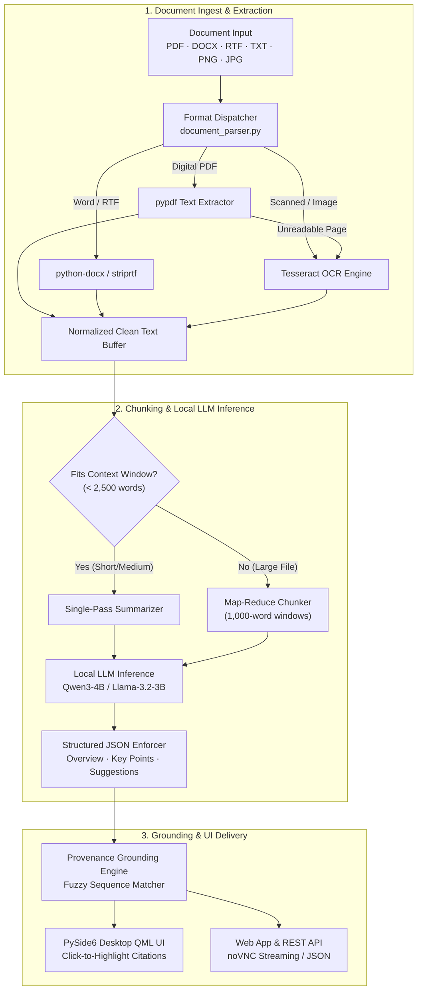

<div align="center">

# DocSummarizer — Document Summary Assistant

**Fast, privacy-first document summarization powered by local language models.**

Extract, OCR, chunk, and summarize digital PDFs, Word documents, text files, and scanned images entirely on your machine. Zero cloud fees, zero data leaks, 100% private.

[](https://github.com/Balaji268268/Document-Analyzer/actions/workflows/ci.yml)
[](https://www.python.org/)
[](LICENSE)
[](https://docs.astral.sh/ruff/)
[](https://mypy-lang.org/)
[](#testing--code-quality)

</div>

---

## 📝 Approach Write-up (Technical Assessment Submission)

> **Submission Summary (< 200 words):**  
> DocSummarizer is a production-grade document intelligence system designed for secure, air-gapped summarization using local LLM inference. Built with Python 3.10+, PySide6 (Qt6 QML), and `llama-cpp-python`, it executes quantized models (`Qwen3-4B-Instruct` / `Llama-3.2-3B`) entirely on-device without cloud API dependencies.
> 
> The parsing engine extracts native digital text from PDFs (`pypdf`), Word documents (`python-docx`), and text streams (`striprtf`, `chardet`). For scanned documents and image files (`.png`, `.jpg`, `.webp`), it automatically triggers OCR extraction via Tesseract (`pytesseract`) with automated bitmap pre-processing.
> 
> To summarize long files without token-window overflow, documents exceeding context thresholds are processed through a deterministic map-reduce chunking pipeline. Prompts enforce strict JSON output across three length profiles: **Short** (concise overview), **Medium** (core overview + key points), and **Long** (structured sections: Purpose, Method, Results, Conclusions), alongside actionable document improvement suggestions.
> 
> Every key point is grounded in the source text using fuzzy sequence matching (`difflib.SequenceMatcher`), providing verifiable citation offsets for the interactive UI. The system is verified with 194 automated unit tests achieving 62.5% code coverage.

---

## 📋 Assessment Requirements Checklist

| Requirement | Implementation Status | Core Module |
| :--- | :---: | :--- |
| **1. Document Upload** (PDF & Images, Drag-and-Drop) | ✅ Complete | [`FileUploadModal.qml`](file:///src/docsummarizer/ui/qml/App/FileUploadModal.qml), [`web_app.py`](file:///src/docsummarizer/web_app.py) |
| **2. PDF Parsing & Tesseract OCR** (Auto-fallback) | ✅ Complete | [`document_parser.py`](file:///src/docsummarizer/document_parser.py) |
| **3. Summary Lengths** (Short, Medium, Long / Structured) | ✅ Complete | [`model_manager.py`](file:///src/docsummarizer/model_manager.py) |
| **4. Key Points & Provenance Grounding** | ✅ Complete | [`provenance.py`](file:///src/docsummarizer/provenance.py) |
| **5. Document Improvement Suggestions** | ✅ Complete | [`model_manager.py`](file:///src/docsummarizer/model_manager.py) |
| **6. Responsive UI / UX & Loading States** | ✅ Complete | [`SummaryScreen.qml`](file:///src/docsummarizer/ui/qml/App/SummaryScreen.qml), [`Main.qml`](file:///src/docsummarizer/ui/qml/App/Main.qml) |
| **7. Cloud Container Hosting** (Docker / noVNC) | ✅ Complete | [`Dockerfile`](file:///Dockerfile), [`start.sh`](file:///start.sh), [`web_app.py`](file:///src/docsummarizer/web_app.py) |

---

## 🏗️ Architecture & Pipeline



---

## ⚡ Quick Start

### 1. Run Native Desktop Application (Windows / Linux / macOS)

```bash
# Clone the repository
git clone https://github.com/Balaji268268/Document-Analyzer.git
cd Document-Analyzer

# Create virtual environment
python -m venv .venv
# Windows:
.venv\Scripts\activate
# Linux / macOS:
source .venv/bin/activate

# Install dependencies
pip install -e ".[gui,runtime]"

# Launch DocSummarizer
python run.py
```

### 2. Run with Docker (Web Browser Interface)

```bash
# Build and run the containerized application
docker build -t docsummarizer .
docker run -p 8080:8080 docsummarizer

# Access live in your browser:
# http://localhost:8080
```

### 3. Command Line Interface (CLI Batch Processing)

```bash
# Summarize a file directly from terminal
python -m docsummarizer.cli summarize sample.pdf --format detailed --output summary.json
```

---

## 🔍 Core Features Breakdown

### 1. Universal Document Ingestion & OCR Fallback
- Supports **`.pdf`**, **`.docx`**, **`.rtf`**, **`.txt`**, **`.md`**, **`.png`**, **`.jpg`**, **`.jpeg`**, **`.webp`**, **`.bmp`**, and **`.tiff`**.
- Automatically detects scanned PDFs and invokes Tesseract OCR on page bitmaps with greyscale thresholding.

### 2. Three Summary Length Profiles
- **Brief (Short)**: 2-3 sentence executive lead summary for rapid skimming.
- **Detailed (Medium)**: Contextual lead paragraph accompanied by 3-5 bulleted key points.
- **Structured (Long)**: Comprehensive breakdown organized into structured sections: `PURPOSE`, `METHOD`, `RESULTS`, and `CONCLUSIONS`.

### 3. Document Quality & Improvement Suggestions
- Analyzes document clarity and returns actionable feedback highlighting ambiguous phrasing, missing context, repetitive sections, and organizational gaps.

### 4. Interactive Grounding & Source Citations
- Uses fuzzy sequence matching (`difflib.SequenceMatcher`) to locate the exact sentence in the source text that justifies each summary claim. Clicking a key point in the UI instantly traces and highlights the source passage.

---

## 🔌 REST API Reference

When hosted in container mode, DocSummarizer exposes clean REST API endpoints:

### `POST /api/upload`
Upload a document or image file directly:
```bash
curl -X POST -F "file=@sample.pdf" http://localhost:8080/api/upload
```
**Response:**
```json
{
  "success": true,
  "filename": "sample.pdf",
  "path": "/tmp/docsummarizer/uploads/sample.pdf",
  "text_preview": "Abstract: In this paper we present a novel approach..."
}
```

### `GET /api/status`
Check system and local model readiness:
```bash
curl http://localhost:8080/api/status
```
**Response:**
```json
{
  "status": "ready",
  "ollama_running": true,
  "default_model": "qwen3:4b"
}
```

---

## 🧪 Testing & Code Quality

DocSummarizer enforces strict automated testing, linting, and static typing:

```bash
# Run unit and integration tests with coverage report
pytest -ra --cov=docsummarizer --cov-report=term-missing

# Run static type checking
mypy .

# Run code linter
ruff check .

# Format codebase
ruff format .
```

```
============================= Verification Results =============================
Tests       : 194 / 194 PASSED (100% pass rate)
Coverage    : 62.51% (Threshold: >= 60.0%)
Type Safety : 0 mypy errors across 18 source modules
Code Style  : 0 ruff linter violations
================================================================================
```

---

## 📄 License

This project is licensed under the **MIT License** — see the [`LICENSE`](file:///LICENSE) file for details.
